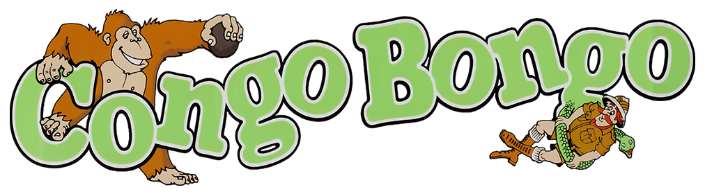

---

## Sega [Congo Bongo] Compatible Gateware IP Core

This Implementation of a compatible Congo Bongo/Tip Top arcade hardware in HDL is the work of [Dar](https://github.com/darfpga).

## Overview

Congo Bongo is an isometric platform game and is Sega's take on Nintendo's legendary "Donkey Kong".
The player takes on the role of a red-nosed safari explorer by the name of Safari Sam, who tries to catch a gorilla named Bongo.

The game consists of four different scenes. Each is timed by a bonus counter in the upper left corner of the screen.
As time passes, the bonus decreases. If the bonus counter reaches zero, a player life is lost.

## Technical specifications

- **SEGA ID:**      834-5156
- **Main CPU:**     Zilog Z80 @ 3.04125 Mhz
- **Sound CPU:**    Zilog Z80 @ 4 Mhz
- **Sound Chip:**   Discrete circuitry, SN76496 @ 4 Mhz
- **Resolution:**   256×224, 256 colors
- **Aspect Ratio:** 8:7
- **Orientation:**  Vertical

## Compatible Platforms

- Analogue Pocket

## Compatible Games

> **ROMs NOT INCLUDED:** By using this gateware you agree to provide your own roms.

| Officials    | Status |
| :----------- | :----: |
| Congo Bongo  |  ✅   |
| Tip Top      |  ✅   |

### ROM Instructions

1. Download and Install [ORCA](https://github.com/opengateware/tools-orca/releases/latest) (Open ROM Conversion Assistant)
2. Download the [ROM Recipes](https://github.com/opengateware/arcade-congo/releases/latest) and extract to your computer.
3. Copy the required MAME `.zip` file(s) into the `roms` folder.
4. Inside the `tools` folder execute the script related to your system.
   1. **Windows:** right click `make_roms.ps1` and select `Run with Powershell`.
   2. **Linux and MacOS:** run script `make_roms.sh`.
5. After the conversion is completed, copy the `Assets` folder to the Root of your SD Card.
6. **Optional:** an `.md5` file is included to verify if the hash of the ROMs are valid. (eg: `md5sum -c checklist.md5`)

> **Note:** Make sure your `.rom` files are in the `Assets/congo/common` directory.

## Status of Features

> **WARNING**: This repository is in active development. There are no guarantees about stability. Breaking changes might occur until a stable release is made and announced.

- [ ] Hi-Score Save

## Credits and acknowledgment

- [Daniel Wallner](https://opencores.org/projects/t80)
- [Dar](https://github.com/darfpga)
- Arnim Laeuger

## Powered by Open-Source Software

This project borrowed and use code from several other projects. A great thanks to their efforts!

| Modules                        | Copyright/Developer     |
| :----------------------------- | :---------------------- |
| [Congo Bongo RTL]              | 2022 (c) Dar            |
| SN76489AN                      | 2005 (c) Arnim Laeuger  |
| [T80]                          | 2001 (c) Daniel Wallner |

## Legal Notices

Congo Bongo © 1983 Sega. All rights reserved.
All other trademarks, logos, and copyrights are property of their respective owners.

The authors and contributors or any of its maintainers are in no way associated with or endorsed by Sega.

[T80]: https://opencores.org/projects/t80
[Congo Bongo RTL]: https://github.com/darfpga/vhdl_congo_bongo

[Congo Bongo]: https://en.wikipedia.org/wiki/Congo_Bongo
